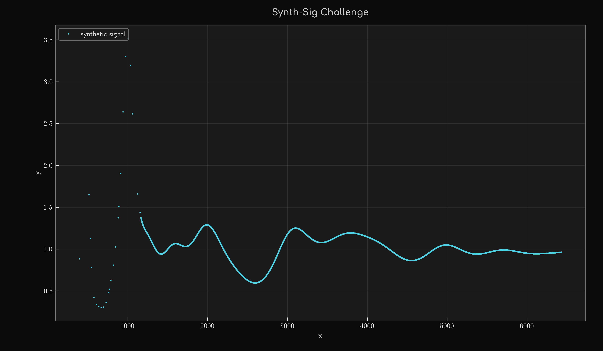

# Synth-Sig Challenge

Hello dear fit experts, analysts, physicists, signal processing folks, mathematicians, and everyone else!

A little task: analyze the signal using methods of your choice, build a model function, and extrapolate the sample points out to 8000. You don't have to reveal your secret weapons — all I care about are the results and a clear statement of how you composed your signal.



I know that without an incentive most people won't get their asses moving — this is about honor. But there is a prize: 
a bottle of Michael Teschke's Spätburgunder "Mutter" 2012 — from Germany's best underground freak winemaker, who sadly gave up his craft years ago, one of my personal favorites.


Since probably only very, very few people will take part, I'll set a generous deadline: December 31, 2026, 23:59 CET. The timestamp of the GitHub issue counts. If you do take part, I'd like to post the winner — or rather their results — on X.

The prize is awarded only if there are at least 3 valid submissions and the winning submission reaches an out-of-sample L1 of `0.02` or lower.

The signal was not generated in an absurdly complex way, but it's not trivial either — otherwise it wouldn't be a challenge.

## Scoring

The error metric is the L1 distance, `L1 = mean(|y_model - y_data|)`. Each submission gets three numbers:

- **In-sample L1** — at the 5293 published sample points (x = 394…6431)
- **Out-of-sample L1** — on the daily grid x = 6432…8000 (1569 points), against the withheld continuation
- **Combined L1** — `0.5 * (in-sample L1 + out-of-sample L1)`

Points below x = 394 are neither published nor scored.

A submission is valid if the file contains every integer x from 394 to 8000, that is 7607 rows, each with one numeric y value, two columns separated by whitespace, no header. Model and data are compared point by point, on that grid.

Qualification threshold: in-sample L1 ≤ 0.02 and out-of-sample L1 ≤ 0.02.

Ranking among the qualified submissions is by out-of-sample L1. The sample points are spaced one day apart from x = 1164 on, so any flexible interpolator drives the in-sample L1 close to zero, which makes it useless as a ranking criterion. Combined L1 breaks ties.

The withheld continuation `synth-sig-holdout.csv` has the same two-column format `x y`, x = 6432…8000 in steps of 1, y with 10 significant digits, and the checksum

`SHA256: 4f7fb96a6c81d7c264c9ae5ca8cd8ddea6418ea7fc8e689475a6aacedc538b81`

The file will be published after the deadline, so the checksum can be verified.

## How to submit

Submit a CSV in the same two-column format with your model evaluated at integer x = 394…8000, plus a clear statement of how you composed your signal.

Preferred:

1. Open a new GitHub Issue using the **Submission** template.
2. Attach your CSV file.
3. Add a short method description.

Fallback:
Try via DM to @Hendrik__Z or chat - not shure, if this is possible


I will calculate the scores privately while the holdout remains secret, then update the participant list and ranking table here. My own demo entries are marked `[Demo]` in the title and stay out of the count.

### Check your submission first

`score_submission.py` in this repository checks the format and computes the in-sample L1:

```
./score_submission.py my_submission.csv
```

It reports missing, duplicate, non-integer or non-finite entries, so you can see whether your file is valid before you submit it. `--plot` opens a window with the published data and your curve.

## Participants

| # | Participant | Method | Date |
|---|-------------|--------|------|
| 1 | – | – | – |
| 2 | – | – | – |
| 3 | – | – | – |
| 4 | – | – | – |
| 5 | – | – | – |
| 6 | – | – | – |
| 7 | – | – | – |
| 8 | – | – | – |
| 9 | – | – | – |
| 10 | – | – | – |

## Ranking

Lower is better. The marked column decides the ranking.

| Rank | Participant | 🏆 **OUT-OF-SAMPLE L1** | In-Sample L1 | Combined L1 | Prize eligible |
|------|-------------|-------------------------|--------------|-------------|----------------|
| 1 | – | **–** | – | – | – |
| 2 | – | **–** | – | – | – |
| 3 | – | **–** | – | – | – |
| 4 | – | **–** | – | – | – |
| 5 | – | **–** | – | – | – |
| 6 | – | **–** | – | – | – |
| 7 | – | **–** | – | – | – |
| 8 | – | **–** | – | – | – |
| 9 | – | **–** | – | – | – |
| 10 | – | **–** | – | – | – |

Cheers, @Hendrik__Z
